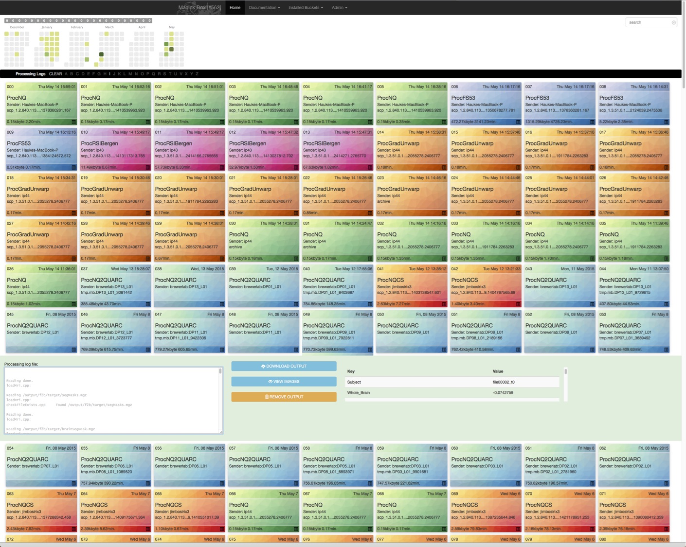

.. _Introduction:

********************
System Architecture
********************

The system runs inside a virtual machine usually called MasterTemplate. Access to the virtual machine is provided by RDP (Microsoft Remote Desktop Connection). If you are running the virtual machines inside VirtualBox a connection will only be successful after installing the "VirtualBox Extension Pack". Use the following information to access the console of the virtual machine::

	MasterTemplate user name: processing, password: processing

MasterTemplate
==============

Inside the virtual machine runs Linux (Ubuntu). There are two partitions, one for the main system (/, 20GB) the other for data storage during processing (/data/scratch, >200GB). The dcmtk tools provide the DICOM connectivity and run as a system service (ps aux | grep store). Processing starts automatically when storescpd receives an image study. As processing is data dependent the user needs to select the appropriate processing stream using the AETitle during DICOM send. The list of available processing (AETitles) streams is displayed on the web interface (see below). After processing is done the routing will be executed. This usually just sends the newly generated images back to a listening DICOM node on your network (such as OsiriX or a PACS).

Each processing stream is implemented as a docker container and is controlled in its own directory (/data/streams/bucket<AETitle>) with a configuration file (info.json). All streams run in parallel as system services under gearman (http://gearman.org). This configuration will buffer large numbers of incoming processing requests and tunnel them through each processing stream one at a time.

All system services are monitored using monit (https://mmonit.com/monit/download/) which provides its own user interface to start/stop services. Monit makes sure that after a restart all system services are also restarted. This functionality uses process id files stored in /data/.pids/. On newer monit implementations instead of pid files the process name is used to detect if a service is running. The storescpd service may be stopped automatically by a heart-beat function if it runs but does not respond to the echoscu command. In this case monit will restart the service automatically. The monit user interface runs locally inside the MagickBox only (http://localhost:2812/).

Functionality provided by MagickBox:

	* DICOM node listening to incoming connections
	* Web interface which provides a user interface for configuration, log files and processed data downloads. The routing functionality can send processed data to any specified DICOM node. When configured to use routing, no continuous access to the web interface is required appart from the initial configuration.

MasterTemplate runs on a Host computer using network address translation (NAT). Using this configuration no separate IP address is required. In order to be accessible to the outside the virtual machine forwards two ports to the outside world.::

	[TCP, Host IP, port 11113] -> [TCP, Guest IP, port 1234]
	[TCP, Host IP, port 2813]  -> [TCP, Guest IP, port 2813]
	[TCP, Host IP, port 4321]  -> [TCP, Guest IP, port 22] (optional ssh access)

The web interface is available at:

	http://<Host IP>:2813/

Images to be processed should be sent to port 11113 on the host IP, using OsiriX or storescu (part of the dcmtk toolkit).

    Web-interface of MagickBox with timeline and processing jobs..

Processing Streams
==================

Each processing stream is stored in a separate directory in /data/streams/. This directory is controlled by the buckets script. Each stream directory contains an info file (info.json) with the following content::

  {
    "name": "My stream",
    "description": "DICOM images are processed.",
    "version": "0.0.1",
    "AETitle": "ProcPics",
    "license": "Feel free to change the code.",
    "enabled": 1
  }

This identifies a stream by an AETitle which has to be used by the sending DICOM node. Information about the available streams are extracted from these info files and displayed in the web-interface.

Every processing stream is linked to a system service that is responsible for scheduling the stream. Monit is used to monitor these services. The monit configuration files in /etc/monit/conf.d/processing-bucket<AETitle>.conf describes for each bucket the stream which can start/stop/restart the processing. 

The script starts the processing stream using a gearman services. Each gearman deamon will wait for a processing job, or list of jobs and execute them one after another (first in - first out). Warning: This does not prevent several streams to run at the same time. For example sending DICOM images between nodes is a separate gearman service and computation will run in parallel with DICOM Send operations.
